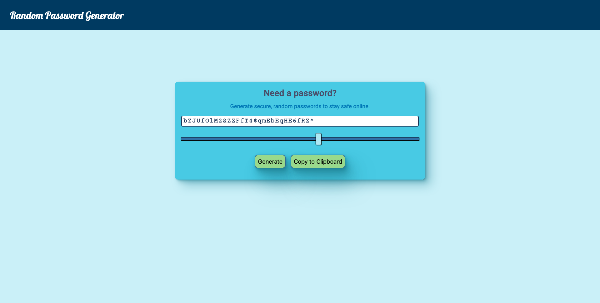
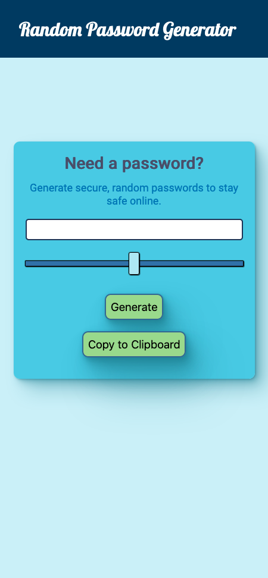

# Random Password Generator

[Javier Reina](https://github.com/jr31na) built the logic for the password generator and I created the preliminary design.

## Screenshots

## 🛠 Made with

- HTML
- CSS
- JavaScript

## Warnings

- 🚨 UI is not fully responsive (yet) for some smaller screens (<420px)
- 🚨 While I built the design in pure CSS, it still utilizes some Bootstrap since Javier made the initial design with Bootstrap.
- 🚨 The "Copy to Clipboard" button does not work, yet...

# Acknowledgements:

- [Coolors - Color Scheme Generator](https://coolors.co/)
- [Custom Style for Range Input Slider](https://css-tricks.com/styling-cross-browser-compatible-range-inputs-css/)
